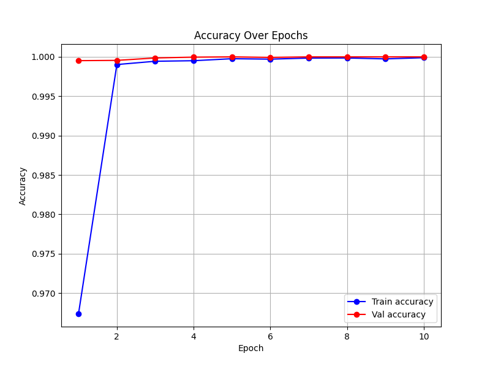
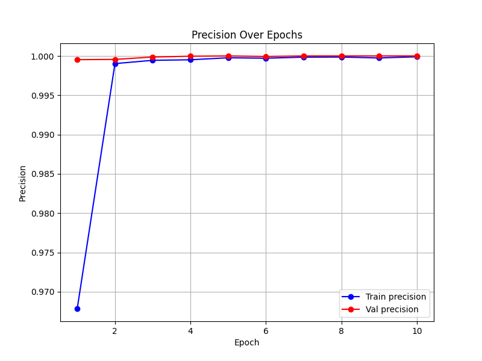
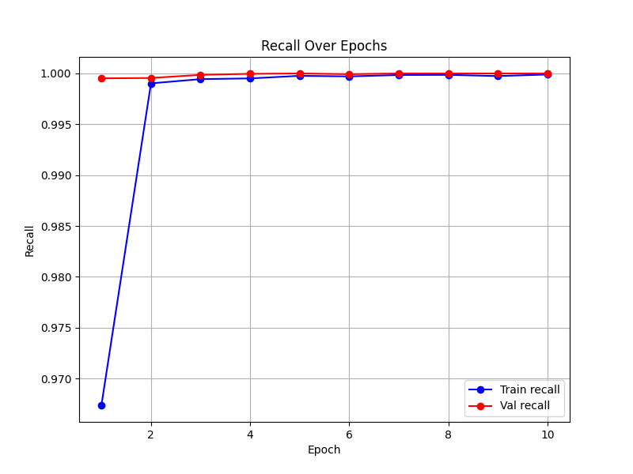
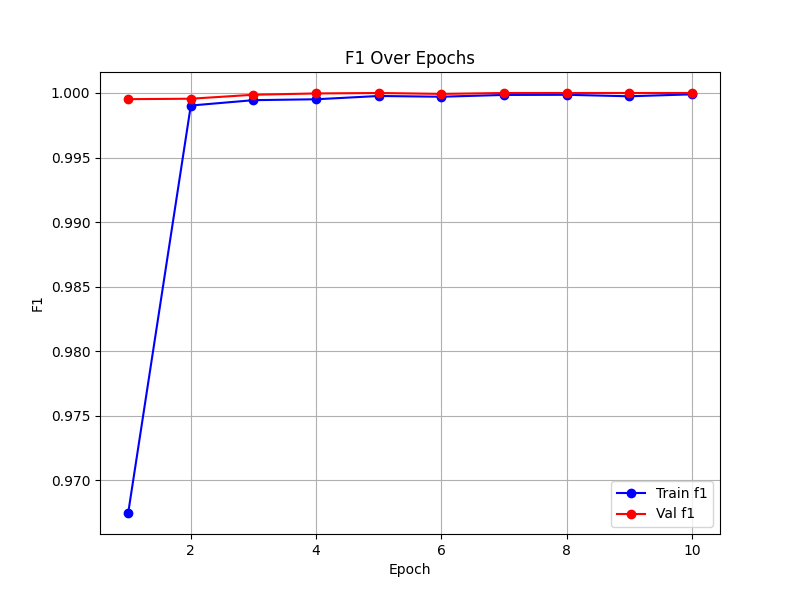
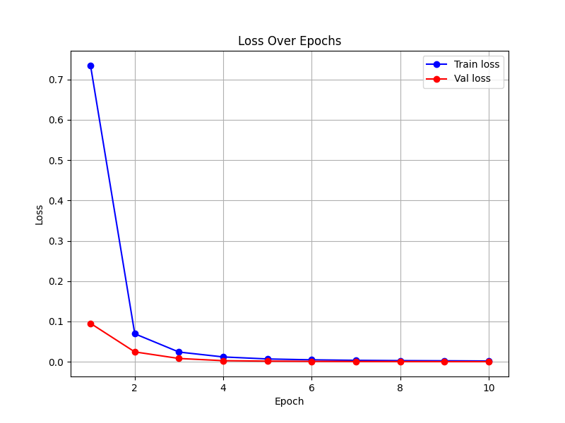
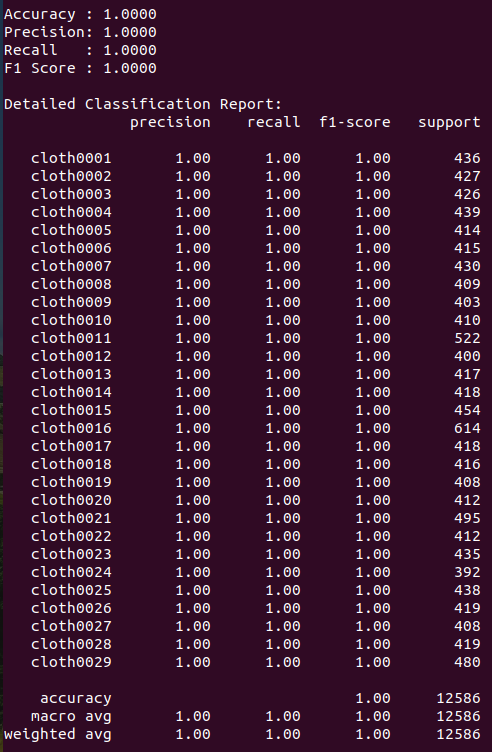

## About The Project

<!-- [![Product Name Screen Shot][product-screenshot]](https://example.com)

Here's a blank template to get started. To avoid retyping too much info, do a search and replace with your text editor for the following: `OLORIN-SRL`, `HYPER-CLASS`, `twitter_handle`, `linkedin_username`, `email_client`, `email`, `project_title`, `project_description`, `project_license` -->


Hyperspectral Imaging (HSI) is the method of capturing and processing the information spread across the electromagnetic spectrum. The part of this information that falls in visible range(380 – 760 nm), is what human eye sees. But there are more bands and therefore there are more information that are not being captured by normal imaging. Since in HSI, the data in multiple bands are processed, more features from the data can be extracted. These features can be material properties, texture, and chemical composition differences. Also, there could be some defects that don’t get revealed in the visible range, which makes HSI a promising solution for both classification and anomaly detection in quality control section.

There are many different fabrics in the textile industry, which may have some differences in normal imaging. We propose that by using HSI and processing the acquired data, we can extract more features for each fabric, which helps to distinguish them from each other better and more effective.

The classifier that we propose consists of a pre-trained backbone and some additional layers. We use the backbone for a technique named Transfer Learning, in which we pick a model that is pre-trained on a big dataset such as ImageNet, and then we adapt it to our classification problem. To do so, we fine-tune the last layers of the backbone, which means we unfreeze them to be trained with our dataset to adjust the specific task better. Also, before the final classification layer, we add 50% dropout layer, which ignores a portion of the neurons to prevent the model from overfitting on the training data and helps it to generalize better on the data. Another useful step that we put in the classifier is to include data augmentation, which is dataset expansion by applying the random realistic transformations such as rotations and flips, to reduce the risk of overfitting on the data. 

The structure of our classifier is adjustable and scalable, and it can easily integrate with HSI technique with different filters and band length, without changing the whole structure. It can accept both normal RGB images(which have (H,W,3) shape), and Hyperspectral images(which can be interpreted as (H,W,1,N), where N is the number of channels, and 1 is because they are grayscale). With this structure, it is possible to pass all the Hyperspectral images from different channels to the model, or simply passing their average image which is a normal RGB image. In both scenarios, our classifier is able to distinguish between different classes of data.

We anticipate that HSI data can help the feature extraction phase of our classifier, and this added information from HSI will help to have a more robust and reliable classification of different fabrics, and can outperform the conventional classifiers which were trained on the normal RGB images.

<p align="right">(<a href="#readme-top">back to top</a>)</p>


### Built With

* [](https://pytorch.org/)
* [](https://pytorch.org/vision/stable/)
* [](https://scikit-learn.org/)
* [](https://numpy.org/)

<p align="right">(<a href="#readme-top">back to top</a>)</p>


<!-- GETTING STARTED -->
## Getting Started

Follow the steps below, to install the packages, run the training, and see the results!

### Prerequisites

We did the project with Python 3.12.4 and on Ubuntu 22.04. 

### Preparation

1. Make sure your GPU setup is working:
   ```python
   import torch
   torch.cuda.is_available()
   ```
   if you see "True", you are ready!
2. Install the necessary packages
   ```sh
   pip install torch torchvision scikit-learn numpy argparse 
   ```
3. Run the training script
   ```sh
   python train.py --train_dir ../data/train --val_dir ../data/val --model_save_path best_model.pth --img_size [300, 300] --batch_size 32 -epochs 20 --learning_rate 1e-4 --patience 5
   ```
   Note that training directory and validation directory must be passed as arguments, but for the rest, you can simply skip them and the script will use default values.
4. Run the inference script
   ```sh
   python inference.py --model_path best_model.pth --test_dir ./videos_split/test --img_size [300, 300] --batch_size 32
   ```
   Note that test directory and model path must be passed as arguments, but for the rest, you can simply skip them and the script will use default values.

Also, remember to check the directory structure:
```plaintext
📂 HYPER-CLASS/
 ├── 📂 data/               # Contains dataset
 │   ├── 📂 train/          # Training images
 │   ├── 📂 test/           # Test images
 │   ├── 📂 val/            # Validation images
 ├── 📂 models/             # Trained models
 │   ├── efficientnet_model.pth
 |   ├── .
 |   ├── .
 ├── 📂 scripts/            # Training and testing scripts
 │   ├── train.py
 │   ├── test.py
 ├── 📄 README.md           # Project documentation
```

<p align="right">(<a href="#readme-top">back to top</a>)</p>


<!-- USAGE EXAMPLES -->
## Results

Here are the performance metrics on training and valdiation sets.


<!-- 


 -->


<!-- And here is the report for the inference on the test set. -->


<!--  -->

<p align="right">(<a href="#readme-top">back to top</a>)</p>


<!-- ROADMAP -->
<!-- ## Roadmap -->

<!-- - [x] AI model training -->

<!-- See the [open issues](https://github.com/OLORIN-SRL/HYPER-CLASS/issues) for a full list of proposed features (and known issues). -->

<!-- <p align="right">(<a href="#readme-top">back to top</a>)</p> -->


<!-- CONTRIBUTING -->
<!-- ## Contributing

Contributions are what make the open source community such an amazing place to learn, inspire, and create. Any contributions you make are **greatly appreciated**.

If you have a suggestion that would make this better, please fork the repo and create a pull request. You can also simply open an issue with the tag "enhancement".
Don't forget to give the project a star! Thanks again!

1. Fork the Project
2. Create your Feature Branch (`git checkout -b feature/AmazingFeature`)
3. Commit your Changes (`git commit -m 'Add some AmazingFeature'`)
4. Push to the Branch (`git push origin feature/AmazingFeature`)
5. Open a Pull Request

<p align="right">(<a href="#readme-top">back to top</a>)</p>

### Top contributors:

<a href="https://github.com/OLORIN-SRL/HYPER-CLASS/graphs/contributors">
  
</a> -->


<!-- LICENSE -->
<!-- ## License

Distributed under the project_license. See `LICENSE.txt` for more information.

<p align="right">(<a href="#readme-top">back to top</a>)</p> -->


<!-- CONTACT -->
<!-- ## Contact -->

<!-- Francesco Solinas - francesco.solinas@olorin.tech

Project Link: [https://github.com/OLORIN-SRL/HYPER-CLASS](https://github.com/OLORIN-SRL/HYPER-CLASS)

<p align="right">(<a href="#readme-top">back to top</a>)</p> -->


<!-- MARKDOWN LINKS & IMAGES -->
<!-- https://www.markdownguide.org/basic-syntax/#reference-style-links -->
[contributors-shield]: https://img.shields.io/github/contributors/OLORIN-SRL/HYPER-CLASS.svg?style=for-the-badge
[contributors-url]: https://github.com/OLORIN-SRL/HYPER-CLASS/graphs/contributors
[forks-shield]: https://img.shields.io/github/forks/OLORIN-SRL/HYPER-CLASS.svg?style=for-the-badge
[forks-url]: https://github.com/OLORIN-SRL/HYPER-CLASS/network/members
[stars-shield]: https://img.shields.io/github/stars/OLORIN-SRL/HYPER-CLASS.svg?style=for-the-badge
[stars-url]: https://github.com/OLORIN-SRL/HYPER-CLASS/stargazers
[issues-shield]: https://img.shields.io/github/issues/OLORIN-SRL/HYPER-CLASS.svg?style=for-the-badge
[issues-url]: https://github.com/OLORIN-SRL/HYPER-CLASS/issues
[license-shield]: https://img.shields.io/github/license/OLORIN-SRL/HYPER-CLASS.svg?style=for-the-badge
[license-url]: https://github.com/OLORIN-SRL/HYPER-CLASS/blob/master/LICENSE.txt
[linkedin-shield]: https://img.shields.io/badge/-LinkedIn-black.svg?style=for-the-badge&logo=linkedin&colorB=555
[linkedin-url]: https://linkedin.com/in/linkedin_username
[product-screenshot]: images/screenshot.png
[Next.js]: https://img.shields.io/badge/next.js-000000?style=for-the-badge&logo=nextdotjs&logoColor=white
[Next-url]: https://nextjs.org/
[React.js]: https://img.shields.io/badge/React-20232A?style=for-the-badge&logo=react&logoColor=61DAFB
[React-url]: https://reactjs.org/
[Vue.js]: https://img.shields.io/badge/Vue.js-35495E?style=for-the-badge&logo=vuedotjs&logoColor=4FC08D
[Vue-url]: https://vuejs.org/
[Angular.io]: https://img.shields.io/badge/Angular-DD0031?style=for-the-badge&logo=angular&logoColor=white
[Angular-url]: https://angular.io/
[Svelte.dev]: https://img.shields.io/badge/Svelte-4A4A55?style=for-the-badge&logo=svelte&logoColor=FF3E00
[Svelte-url]: https://svelte.dev/
[Laravel.com]: https://img.shields.io/badge/Laravel-FF2D20?style=for-the-badge&logo=laravel&logoColor=white
[Laravel-url]: https://laravel.com
[Bootstrap.com]: https://img.shields.io/badge/Bootstrap-563D7C?style=for-the-badge&logo=bootstrap&logoColor=white
[Bootstrap-url]: https://getbootstrap.com
[JQuery.com]: https://img.shields.io/badge/jQuery-0769AD?style=for-the-badge&logo=jquery&logoColor=white
[JQuery-url]: https://jquery.com 
